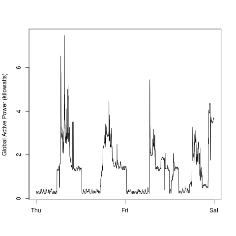
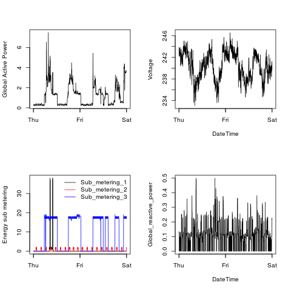

## Introduction

* <b>Description</b>: Measurements of electric power consumption in one household with a one-minute sampling rate over a period of almost 4 years. Different electrical quantities and some sub-metering values are available.

The "Individual household electric power consumption Data Set" is used. The dataset can be downloaded from <a href="https://d396qusza40orc.cloudfront.net/exdata%2Fdata%2Fhousehold_power_consumption.zip">Electric power consumption</a> [20Mb]

## Dataset description

<ol>
<li><b>Date</b>: Date in format dd/mm/yyyy </li>
<li><b>Time</b>: time in format hh:mm:ss </li>
<li><b>Global_active_power</b>: household global minute-averaged active power (in kilowatt) </li>
<li><b>Global_reactive_power</b>: household global minute-averaged reactive power (in kilowatt) </li>
<li><b>Voltage</b>: minute-averaged voltage (in volt) </li>
<li><b>Global_intensity</b>: household global minute-averaged current intensity (in ampere) </li>
<li><b>Sub_metering_1</b>: energy sub-metering No. 1 (in watt-hour of active energy). It corresponds to the kitchen, containing mainly a dishwasher, an oven and a microwave (hot plates are not electric but gas powered). </li>
<li><b>Sub_metering_2</b>: energy sub-metering No. 2 (in watt-hour of active energy). It corresponds to the laundry room, containing a washing-machine, a tumble-drier, a refrigerator and a light. </li>
<li><b>Sub_metering_3</b>: energy sub-metering No. 3 (in watt-hour of active energy). It corresponds to an electric water-heater and an air-conditioner.</li>

<li><b>DateTime</b>: A column created for the purpose of plotting graphs; combines Date and Time column (format yyyy-mm-dd hh:mm:ss IST)
</ol>

## Loading the data

Data from the dates 2007-02-01 and 2007-02-02 only are used. 

* Using fread() from data.table package is faster compared to other read methods. 

* as.Date() and as.POSIXct() are used to appropriately format the Date and DateTime columns respectively

## Making Plots

The four plots are constructed using the base plotting system.

* The plots are stored in PNG files with width of 480 pixels and height of 480 pixels.

* The plots' source code is stored in the same name as the plot. eg: `plot1.R` generates the `plot1.png`

The construced plots are as below and **to reproduce the plots execute the corresponding R script**

### Plot 1

```R
#plot1.R
with(f2, hist(Global_active_power, col = "red", xlab = "Global Active Power (kilowatts)",
			main = "Global Active Power"))
```


### Plot 2

```R
#plot2.R
with(f2, plot(DateTime, Global_active_power, type='l', 
	ylab = "Global Active Power (kilowatts)", xlab = ""))
```



### Plot 3

```R
#plot3.R
with(f2, {
    plot(DateTime, Sub_metering_1, type = 'l', ylab = "Energy sub metering", xlab = "")
    points(DateTime, Sub_metering_2, type='l', col="red")
    points(DateTime, Sub_metering_3, type='l', col="blue")
})
```


### Plot 4

```R
#plot4.R
with(f2,{
    #plot 1
    plot(DateTime, Global_active_power, type='l', ylab = "Global Active Power", xlab = "")
    
    #plot2
    plot(DateTime, Voltage, type = 'l')
    
    #plot3
    {
    plot(DateTime, Sub_metering_1, type = 'l', ylab = "Energy sub metering", xlab = "")
    points(DateTime, Sub_metering_2, type='l', col="red")
    points(DateTime, Sub_metering_3, type='l', col="blue")
    #setting the legend
    legend("topright", col = c("black", "red", "blue"), 
	c("Sub_metering_1", "Sub_metering_2","Sub_metering_3"), lty = "solid", bty="n")
    }
    
    #plot4
    plot(DateTime, Global_reactive_power, type = 'l')
})
```



